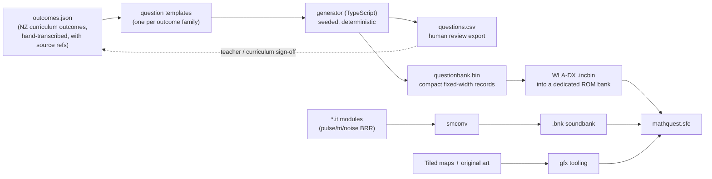

# feat: SNES maths platformer (.sfc) for NZ curriculum ages 5-8

## Overview

Build an original Super Mario World-inspired side-scrolling platformer that ships as a real
Nintendo SNES ROM (`.sfc`), where the core loop is practising mathematics from the refreshed
New Zealand Mathematics and Statistics curriculum for children aged 5-8 (Years 1-4). The
platforming exists to make the maths fun, not the other way around: maths is expressed as
movement (walk through the door under the right answer) rather than as a quiz overlay.

The build targets authentic SNES output — a LoROM `.sfc` with a battery-backed SRAM save for
high scores, and an 8-bit-style chiptune soundtrack driven by the SPC700.

This is a greenfield project. The repository currently contains only an Astro blog
(AstroPaper 4.4.0) and shares no code with this work.

## Problem Frame

Children aged 5-8 in New Zealand are working through Phase 1 (Years 0-3) and the start of
Phase 2 (Years 4-6) of the refreshed Mathematics and Statistics curriculum, which became
official policy on 1 January 2026. Practice at this age is typically worksheet-shaped: it
tests but does not motivate, and it demands reading ability that a five-year-old does not
reliably have.

The opportunity is to put curriculum-aligned practice inside a game loop children already
want to play, on a platform (SNES) whose constraints force the design to stay simple, fast,
and readable. The constraint that matters most: **at Year 1 the game must be playable by a
child who cannot yet read.** That single constraint drives the input model, the question
representation, and the failure handling throughout this plan.

## Assumptions (user did not answer scoping questions)

These four decisions were put to the user and went unanswered, so the plan proceeds on the
recommended option for each. Each is cheap to revisit before Unit 5; after Unit 6 the first
two become expensive.

- **A1 — Maths integration model:** mixed. Routine practice is woven into movement
  (collect only groups of five), and explicit *answer-gates* appear at checkpoints and
  bosses. No menu-driven quiz screens.
- **A2 — Year-level targeting:** the child or parent selects Year 1-4 on a profile screen,
  saved to SRAM. That sets the question band; a small in-band adaptive nudge responds to
  recent accuracy. High-score tables are kept per year level.
- **A3 — First deliverable:** a vertical slice — World 1 only (3 levels + boss), covering
  counting/subitising and addition/subtraction, with the *entire* pipeline wired end to end.
- **A4 — Repository layout:** a self-contained `game/` tree in this repository, leaving the
  Astro site untouched.

## Requirements Trace

- **R1.** Ships as a valid SNES ROM in `.sfc` format that boots on accurate emulators
  (Mesen2, bsnes) and is structurally valid for flash-cart/real-hardware use.
- **R2.** Maths content is traceable to named outcomes of the refreshed NZ Mathematics and
  Statistics curriculum, banded by year level for ages 5-8 (Years 1-4).
- **R3.** The maths is the core loop, not a bolt-on: progression through a level is gated on
  mathematical success, and routine practice is embedded in ordinary movement.
- **R4.** Playable without reading ability at Year 1: quantities and questions are shown as
  visual representations (dot patterns, ten-frames, icon groups) and numerals, not sentences.
- **R5.** Answering wrongly never costs a life or ends a run; it produces a gentle retry.
- **R6.** 8-bit-style chiptune music and sound effects play from the SPC700, with distinct
  cues for correct, incorrect, level clear, and high-score entry.
- **R7.** High scores persist across power cycles via battery-backed SRAM, held per year
  level, and survive an uninitialised or corrupted SRAM chip without crashing.
- **R8.** The ROM builds reproducibly from a single command and in CI, publishing the `.sfc`
  as an artifact.
- **R9.** Automated tests cover both the maths content (host-side) and the running ROM
  (emulator-driven), so curriculum correctness and gameplay regressions are caught in CI.
- **R10.** All art, music, level design, characters, and naming are original works. No
  Nintendo assets, sprites, music, level data, or trademarks are used or reproduced.

## Scope Boundaries

Explicit non-goals for this plan:

- **Not a Super Mario World ROM hack.** No Nintendo ROM is used as a base, patched, or
  distributed. "Super Mario World inspired" means the genre conventions (side-scrolling
  platformer, overworld map, physics feel), implemented from scratch with original assets.
  See R10 — this is a hard boundary, not a preference.
- **No online high-score leaderboard.** Scores are local to the cartridge SRAM. A networked
  leaderboard is impossible on stock SNES hardware and out of scope.
- **No voice-over or speech.** The SPC700 sample budget (~58KB post-BRR for all music and
  effects) cannot carry spoken instructions. Comprehension is carried visually.
- **No multiplayer** in this phase.
- **No te reo Māori localisation** in the vertical slice. The curriculum uses bilingual
  strand naming and this is worth doing, but it is a content-and-font workstream of its own;
  deferred with a note in Unit 3 to keep the string layer indirected so it stays possible.
- **No changes to the Astro blog** beyond two config exclusions (Unit 1). The site's pages,
  content, and build are untouched.
- **Worlds 2-5** (place value/multiplication, measurement/geometry, statistics/probability)
  are designed for in the data model but not built in this phase (per A3).

## Context & Research

### Repository findings

The repository is AstroPaper 4.4.0 — an Astro 4.14 blog with Tailwind, React islands, and
markdown posts under `src/content/blog/`. Nothing here is reusable for SNES development. Two
findings do matter, because they will silently break the existing CI if missed:

- **`.prettierignore` is an allowlist**, not a denylist. It ignores `/*` and then re-includes
  only `/src`, `/public`, `/.github`, `tsconfig.json`, `astro.config.ts`, `package.json`,
  `.prettierrc`, `eslint.config.mjs`, and `README.md`. A new `game/` tree is therefore
  *already* excluded from `npm run format:check`. Consequence: the game's own TypeScript will
  not be format-checked by the blog's tooling, so the game tree needs its own formatting
  script if formatting is wanted there.
- **`eslint.config.mjs` ignores only `dist/**` and `.astro`.** The existing CI step
  `npm run lint` runs `eslint .` across the whole repository, so it *will* lint
  `game/tools/**/*.ts` under the blog's rule set. Unit 1 must add `game/**` to the ESLint
  ignores, or the blog's CI job starts failing on game code.
- **`.github/workflows/ci.yml` has `timeout-minutes: 3`** and runs on Node 18. A ROM build
  plus an emulator test suite will not fit in that budget and must not be added to that job.
  The game needs a separate workflow with path filters and its own timeout.
- `.gitignore` is a conventional denylist (`dist/`, `node_modules/`, logs, `.env`). It needs
  game build outputs added; `game/` itself will be tracked normally.

There are no `docs/plans/`, `docs/brainstorms/`, `docs/solutions/`, `AGENTS.md`, or
`CLAUDE.md` files. No institutional learnings exist to carry forward.

### Toolchain research

- **PVSnesLib 4.6.0** (MIT licence) is the practical choice for SNES development in C. It
  bundles the `816-tcc` compiler and linker plus a library covering backgrounds, sprites,
  pad input, music and sound, and it ships **a ready-to-use Docker image** and GitHub Actions
  build workflows — which is what makes a reproducible, CI-built ROM realistic. Prebuilt
  releases exist for Linux, macOS, and Windows. Alternatives considered below.
- **Audio:** PVSnesLib uses **Impulse Tracker (`.it`) modules** as its music and SFX source
  format, converted by the `smconv` tool into a `.bnk` soundbank plus an `.asm` bank
  declaration linked into the ROM. Hard limits: **8 channels maximum**, playback rate not
  exceeding 128kHz per note, and **samples must fit in ~58KB after BRR compression** (8-bit
  samples compress to 9/16 of source size, 16-bit to 9/32) out of the SPC700's ~64KB total.
  Loop points must be divisible by 16. Modules are authored in OpenMPT or Schism Tracker.
  Soundbanks live in dedicated 32KB ROM banks and are selected at runtime by bank index.
- **SRAM:** on by default in PVSnesLib. The ROM header's cartridge-type byte is `$02` for
  ROM+save-RAM (vs `$00` ROM-only); the ROM-layout byte is `$20` for LoROM, `$21` for HiROM,
  `+$10` for FastROM. In LoROM the cartridge SRAM is mapped repeatedly in 8KB windows from
  `$0000-$1FFF` onward. Emulators persist this to a `.srm` file beside the ROM.
- **Testing:** Mesen2 supports a **headless `--testrunner` mode** that loads a ROM plus a Lua
  script, runs at maximum speed, and exits when the script calls `emu.stop(exitCode)` — the
  process exit code is what CI asserts on. The Lua API can read and write emulated RAM, drive
  controller input, and capture screenshots at specific frames. This is the backbone of R9.
  PVSnesLib documents a Mesen2 workflow using the Event Viewer to measure per-frame CPU
  headroom against VBlank, which gives a performance-regression signal too.

### Curriculum research — and an important caveat

The refreshed **New Zealand Curriculum: Mathematics and Statistics (Years 0-10), 2025** came
into effect on **1 January 2026**, replacing the previous statements. It organises teaching
sequences across Years 0-10 into **six strands: Number, Algebra, Measurement, Geometry,
Statistics, and Probability**, grouped into phases. **Phase 1 covers Years 0-3** and
**Phase 2 covers Years 4-6**; each phase has a progress outcome describing what students
understand, know, and can do by the end of it, plus a year-by-year teaching sequence.

Ages 5-8 in the NZ system map to **Years 1-4** — i.e. all of Phase 1 plus the first year of
Phase 2.

Specific outcomes confirmed during research:

- **Year 1 (Number):** subitise the number of objects in a collection of up to 10, including
  by combining two patterns of 1-5 objects; count forwards and backwards in 1s, 2s, and 10s
  from any whole number between 1 and 20, then between 1 and 100.
- **Year 2 (Number):** recognise, read, write, and order numbers to 100.
- **Year 3 (Number):** count forwards and backwards in 2s, 3s, 4s, 5s, 8s, 10s, and 100s;
  recall multiplication and division facts for 2s, 3s, 4s, 5s, 8s, and 10s; work with halves,
  thirds, and quarters.
- **Year 4 (Number):** multiplication and division of the form 23 × 5 or 44 ÷ 4; introduction
  of decimal tenths and connecting simple fractions to decimal numbers.

> **Caveat that shapes the architecture:** the official curriculum pages on
> `newzealandcurriculum.tahurangi.education.govt.nz` returned HTTP 403 to every automated
> fetch attempted during planning (both the fetch tool and a direct request through the
> network proxy). The outcomes above come from search-result extracts and secondary sources,
> **not from a verbatim read of the official statement.** They are directionally right and
> sufficient to design against, but they are not a substitute for the source text.
>
> This is precisely why Unit 3 stores curriculum outcomes as **editable data with a
> per-record `source` field**, and why a human curriculum review gate sits between the
> vertical slice and any content scale-up. A person with browser access must transcribe the
> official Phase 1 and Phase 2 teaching sequences into `outcomes.json` before content is
> considered final. Nothing in the codebase should hardcode a curriculum claim.

### External references

- PVSnesLib project and wiki (toolchain, audio pipeline, Mesen2 workflow, SRAM defaults)
- Mesen2 Lua API and `--testrunner` headless documentation
- SNES memory map and cartridge header documentation (LoROM mapping, SRAM windows,
  cartridge-type and ROM-layout bytes)

## Key Technical Decisions

- **PVSnesLib 4.6.0 in C, built inside its official Docker image.** Rationale: actively
  maintained, MIT-licensed, has a working C toolchain plus graphics/audio tooling, and ships
  Docker + CI support so the build is reproducible for anyone and in Actions. Assembly is
  used only where profiling shows it is needed.
- **LoROM + FastROM, cartridge type `$02` (ROM + SRAM), 8KB SRAM, `.sfc` output.** Rationale:
  LoROM is the simplest correct mapping for a project this size, FastROM buys CPU headroom
  for free, and `$02` is what makes high scores persist (R7). 8KB is far more than the save
  data needs, and it is the standard smallest battery-backed size.
- **Questions are generated at build time in TypeScript and baked into the ROM as a binary
  table; the console only looks up and renders.** This is the most consequential decision in
  the plan. The 65816 has no divide instruction and slow multiply, so generating
  well-formed questions with plausible distractors on-console would be both fiddly and slow.
  Moving generation to the host means: curriculum logic is unit-tested in seconds on a normal
  test runner; generated questions can be exported as human-readable CSV for a teacher to
  review before they become binary; and a curriculum correction is a data change, not an
  assembly change. Console-side code reduces to a table lookup and a PRNG.
- **Answer input is diegetic — the child walks through one of three doors.** No cursor, no
  menu, no confirm button. Directly serves R4: a pre-reader can play, because choosing is
  the same motor action as moving.
- **Wrong answers are never punished with life loss.** A wrong door produces a soft bounce
  back, a gentle audio sting, and an immediate retry with the same question. Serves R5;
  losing a life for a wrong sum is the fastest way to make a five-year-old stop playing.
- **Question rendering is icon-first.** Quantities appear as dot patterns, ten-frames, and
  grouped sprites; numerals appear alongside. Word problems are not used at Years 1-2 and are
  kept to a small controlled vocabulary at Years 3-4.
- **"8-bit" music is achieved through timbre, not hardware.** The SNES SPC700 is a 16-bit
  sample-based chip, not a programmable-waveform chip like the NES. The chiptune character
  comes from authoring the IT modules with very short looped **pulse, triangle, and noise BRR
  samples**. This is both faithful to the requested aesthetic and highly economical: a
  handful of tiny samples leaves most of the 58KB budget spare.
- **Test probes are a deliberate part of the ROM's design.** A small fixed-address RAM
  struct exposes score, current question ID, answer state, lives, and a frame counter so Lua
  tests can assert on game state without symbol-file guesswork.

## Open Questions

### Resolved during planning

- **Which SNES toolchain?** PVSnesLib 4.6.0 — the only actively maintained C SDK with Docker
  and CI support and a permissive licence.
- **Where do questions get generated?** Host-side at build time (see decisions above).
- **Can a ROM be meaningfully tested in CI?** Yes — Mesen2 `--testrunner` with Lua and a
  process exit code makes ROM-level assertions a normal CI step.
- **Which year levels does "ages 5-8" cover?** NZ Years 1-4: all of Phase 1 (Years 0-3) plus
  the first year of Phase 2 (Years 4-6).
- **Does "8-bit music" mean the SNES is 8-bit?** No — the aesthetic is delivered through
  sample choice on the SPC700, as described above.

### Deferred to implementation

- **Whether WLA-DX symbol output is directly consumable by Mesen2's Lua API.** If it is,
  tests can reference symbolic names; if not, they use the fixed probe-block addresses from
  Unit 2. The probe block is designed to make this question non-blocking either way.
- **Exact metatile collision granularity** (8×8 vs 16×16) — depends on how the World 1 tileset
  actually draws once art exists.
- **Final BRR sample budget split** between music and SFX — not knowable until the first two
  tracks are authored and converted.
- **Whether PVSnesLib 4.6.0's Tiled map tooling covers the needed layer features**, or whether
  a small custom exporter is required. Determined on first contact in Unit 5.
- **Per-frame CPU headroom under a full entity load** — measured with the Mesen2 Event Viewer
  during Unit 5, not predictable in advance.
- **Whether Year 4 content fits World 1's structure** or needs its own world — resolved once
  the Year 1-2 bands are playable and pacing is observable.

## High-Level Technical Design

> *This illustrates the intended approach and is directional guidance for review, not
> implementation specification. The implementing agent should treat it as context, not code
> to reproduce.*

### Content pipeline: from curriculum outcome to ROM bytes



The dotted review loop is the mechanism that keeps R2 honest given the source-access caveat:
generated questions are reviewable as plain CSV *before* they are compiled into the ROM.

### Question record shape (directional)

A fixed-width record keeps the console-side reader trivial — no parsing, just an indexed
read. Roughly eight bytes per question, carrying: the outcome identifier it satisfies, the
year band, a template/representation code telling the renderer how to draw it (dot pattern,
ten-frame, numeral expression, icon group), the operand values, the correct answer, and two
distractor values. Concrete field widths are an implementation detail; the constraint that
matters is that the record is fixed-width and self-contained, so selecting a question is an
index multiply-and-add rather than a scan.

At roughly 8 bytes per record, a few thousand questions occupy tens of kilobytes — negligible
against a 4-8Mbit ROM, so the bank can be generously sized rather than tightly packed.

### Answer-gate interaction

```
approach gate
  └─ freeze horizontal scroll, raise question banner on the text layer
  └─ three doors spawn, each showing one candidate answer (numeral + icon form)
       │
       ├─ child walks into correct door
       │     └─ chime, score += weight × streak multiplier, mastery[outcome]++
       │        gate opens, scroll resumes
       │
       └─ child walks into wrong door
             └─ soft sting, gentle bounce back, streak resets to 1
                door dims (stays dimmed), same question retried
                NO life lost, NO run ended        ← R5
```

Dimming the chosen wrong door rather than re-randomising means a child converges on the
answer instead of guessing blindly, and it makes the third attempt a certainty — the child
always eventually succeeds and moves on.

## Implementation Units

### Phase 0 — Foundations (prove the ROM can be built and tested at all)

- [ ] **Unit 1: Reproducible `.sfc` build and repo scaffold**

**Goal:** A single command, and a CI job, produce a bootable `.sfc` from source. Nothing about
the game yet — this exists to eliminate toolchain risk before any design effort is spent.

**Requirements:** R1, R8, R10

**Dependencies:** None

**Files:**
- Create: `game/Makefile`
- Create: `game/src/main.c` (boot to a solid colour and a title string)
- Create: `game/src/hdr.asm` (ROM header: LoROM+FastROM, cartridge type `$02`, ROM/SRAM sizes, original game title)
- Create: `game/data/.gitkeep`, `game/tools/.gitkeep`
- Create: `game/README.md` (toolchain setup, build command, emulator instructions, asset-originality statement per R10)
- Create: `game/docker/Dockerfile` or a pinned reference to the upstream PVSnesLib image
- Create: `.github/workflows/game-ci.yml`
- Modify: `eslint.config.mjs` (add `game/**` to the `ignores` array)
- Modify: `.gitignore` (add `game/build/`, `*.sfc`, `*.srm`, `*.bnk`)

**Approach:**
- Pin PVSnesLib to 4.6.0 by digest in the Docker reference so builds stay reproducible.
- Header configuration is the load-bearing part: cartridge type `$02` is what enables the
  SRAM that Unit 7 needs, and getting it wrong is discovered late and painfully. Set it now.
- The new workflow is **separate** from `.github/workflows/ci.yml` — that job has a
  3-minute timeout and lints/builds the blog. Add path filters (`game/**`) so blog PRs do not
  trigger ROM builds and vice versa.
- The ESLint ignore is not optional housekeeping: without it, the blog's existing `npm run lint`
  CI step lints the game's TypeScript under the blog's config and fails.
- Do not commit built ROMs to git; publish the `.sfc` as a CI artifact.

**Patterns to follow:**
- PVSnesLib's own example projects and Docker workflow for Makefile structure.
- The existing `.github/workflows/ci.yml` for job naming and step-emoji conventions, so the
  two workflows read consistently.

**Test scenarios:**
- Clean checkout, single build command, `.sfc` is produced.
- Produced file has a valid SNES header: correct checksum/complement pair, LoROM layout byte,
  cartridge type `$02`, plausible ROM size byte.
- File size is a legal power-of-two ROM size with no 512-byte copier header prepended.
- ROM boots in Mesen2 without an invalid-opcode or reset loop.
- `npm run lint` and `npm run format:check` at the repo root still pass with `game/` present.

**Verification:**
- A `.sfc` artifact is downloadable from a CI run and boots in Mesen2 and bsnes.
- The blog's existing CI job is unaffected and still green.

---

- [ ] **Unit 2: Emulator test harness and RAM probe contract**

**Goal:** Establish the ability to assert on a *running* ROM from CI, before there is a game
to assert on. Every later unit depends on this to prove itself.

**Requirements:** R9

**Dependencies:** Unit 1

**Execution note:** Build this before the game systems, not after. The harness is the
scaffolding that makes every subsequent unit verifiable; retrofitting it later is how ROM
projects end up untested.

**Files:**
- Create: `game/src/testprobe.h` (fixed-address probe struct declaration)
- Create: `game/tests/lua/harness.lua` (shared helpers: read probe fields, press buttons for N frames, wait-for-state with timeout, screenshot)
- Create: `game/tests/lua/test_boot.lua`
- Create: `game/tests/run-rom-tests.sh` (drive Mesen2 `--testrunner` over the Lua suite, aggregate exit codes)
- Modify: `game/src/main.c` (reserve and populate the probe block)
- Modify: `.github/workflows/game-ci.yml` (add the ROM test job)

**Approach:**
- Reserve the probe block at a **fixed, documented WRAM address** so Lua can read it without
  depending on symbol files. Fields: magic value, frame counter, game-state enum, score,
  current outcome ID, current question index, last-answer result, lives, year level.
- The magic value doubles as a sanity check: if Lua reads the wrong address it sees garbage
  instead of silently asserting on nonsense.
- Every Lua test must have a **frame-count timeout** that fails loudly. A hung ROM must fail
  the job, not run until the CI runner times out with no diagnosis.
- Screenshot capture at fixed frames enables golden-image comparison later; wire the capture
  now even if no goldens are committed until Unit 6.
- Investigate whether WLA-DX emits symbols Mesen2 can consume — if so, layer symbolic access
  on top of the probe block, but keep the fixed addresses as the contract.

**Test scenarios:**
- ROM boots and the probe magic is readable within a bounded number of frames.
- The frame counter advances — i.e. the main loop is actually running, not wedged.
- A deliberately failing assertion causes a non-zero process exit (proves the harness can
  actually fail; a test harness that cannot fail is worse than none).
- A ROM that never reaches the expected state fails on timeout rather than hanging.

**Verification:**
- `run-rom-tests.sh` returns non-zero when any Lua assertion fails and zero when all pass.
- The CI job reports ROM test results distinctly from build failures.

---

### Phase 1 — Curriculum content pipeline (the part that must be right)

- [ ] **Unit 3: Curriculum model and question generator (host-side TypeScript)**

**Goal:** Turn named NZ curriculum outcomes into a reviewable, tested, deterministic set of
generated questions banded by year level.

**Requirements:** R2, R4

**Dependencies:** None (parallelisable with Phase 0)

**Execution note:** Implement test-first. This unit encodes claims about a national
curriculum for young children; the tests are the specification and the correctness argument,
and they are cheap to run because none of this touches the console.

**Files:**
- Create: `game/tools/curriculum/outcomes.json` (one record per outcome: stable ID, year, strand, verbatim outcome text, `source` URL/citation, `verified` boolean)
- Create: `game/tools/curriculum/templates/` (one generator per outcome family: subitising, counting sequences, addition/subtraction within 10 and 20, place value, skip counting, simple multiplication, halves/quarters)
- Create: `game/tools/curriculum/generate.ts` (seeded deterministic driver)
- Create: `game/tools/curriculum/distractors.ts` (plausible-wrong-answer rules)
- Create: `game/tools/package.json`, `game/tools/tsconfig.json` (self-contained; not wired to the blog's build)
- Test: `game/tools/curriculum/__tests__/templates.test.ts`
- Test: `game/tools/curriculum/__tests__/coverage.test.ts`
- Test: `game/tools/curriculum/__tests__/distractors.test.ts`

**Approach:**
- **Curriculum outcomes are data, never code.** Each carries its own source citation and a
  `verified` flag that stays `false` until a human confirms it against the official statement.
  The build should warn — loudly — when generating from unverified outcomes.
- Every generated question references the outcome ID it satisfies, making R2's traceability
  mechanical rather than aspirational.
- Distractors must be *pedagogically* plausible, not random: off-by-one, the result of the
  inverse operation, a digit-reversal, a common place-value slip. A random distractor teaches
  nothing and is trivially eliminated by guessing.
- Generation is seeded and deterministic so the same inputs always produce the same bank —
  which is what makes a golden-file test meaningful and diffs reviewable.
- Emit a **human-readable CSV alongside the binary** so a teacher can review actual questions.
- Keep display strings behind an indirection layer so a te reo Māori pass stays possible later
  without restructuring (noted as out of scope above).
- Set the year band mapping explicitly: Year 1 → subitising to 10, counting in 1s/2s/10s to
  100; Year 2 → numbers to 100, addition/subtraction within 20; Year 3 → skip counting in
  2s/3s/4s/5s/8s/10s/100s, multiplication and division facts for those, halves/thirds/quarters;
  Year 4 → two-digit × one-digit, simple division, tenths.

**Test scenarios:**
- Every outcome ID referenced by a template exists in `outcomes.json` (no orphans).
- Every year band 1-4 produces at least the minimum required question count per strand.
- Every generated question's stated answer is arithmetically correct — verified independently
  of the code path that produced it.
- No distractor ever equals the correct answer.
- All distractors are within a plausible range (not negative where the year band has not met
  negative numbers; not wildly out of magnitude).
- Year 1 questions contain no text requiring reading beyond numerals.
- Operands and answers stay inside the numeric range declared for their year band.
- The same seed produces byte-identical output across runs.
- Generating from an outcome with `verified: false` emits a warning.

**Verification:**
- Test suite passes and reports per-year, per-strand question counts.
- `questions.csv` opens cleanly and a reviewer can read actual questions in plain language.

---

- [ ] **Unit 4: Binary question bank format and on-console reader**

**Goal:** Get generated questions into the ROM and back out again on the console, cheaply.

**Requirements:** R2, R3, R8

**Dependencies:** Units 1, 3

**Files:**
- Create: `game/tools/curriculum/encode.ts` (records → `questionbank.bin`)
- Create: `game/docs/questionbank-format.md` (byte-level format spec — the contract between host and console)
- Create: `game/src/questions.c`, `game/src/questions.h` (bank reader, PRNG, selection with no-repeat window)
- Create: `game/tests/lua/test_questions.lua`
- Test: `game/tools/curriculum/__tests__/encode.test.ts` (round-trip and golden-file)
- Modify: `game/Makefile` (generate the bank as a build step; fail the build if generation fails)

**Approach:**
- Fixed-width records only. Selection becomes an index computation, not a scan.
- Place the bank in its own ROM bank so it never collides with code or graphics banks.
- The console-side selector holds a small ring of recently-served question IDs to avoid
  immediate repeats — a child seeing 3+2 four times in a row notices.
- Seed the PRNG from frame counter plus input timing at first interaction, so runs differ.
- Generation runs as part of the ROM build, so a curriculum data change cannot silently fail
  to reach the ROM.
- The format doc is the host/console contract; both sides' tests reference it.

**Test scenarios:**
- Encode then decode in TypeScript round-trips every field exactly.
- The encoder output matches a committed golden binary for a fixed seed.
- Records with out-of-range values are rejected at encode time, not written and discovered on
  console.
- On console: drawing questions for a given year band only ever yields records in that band
  (asserted through the probe block).
- On console: N consecutive draws contain no immediate repeats.
- The bank's record count in the ROM matches the generator's reported count.

**Verification:**
- A ROM-level Lua test draws a sequence of questions and confirms band correctness and
  no-repeat behaviour via the probe block.

---

### Phase 2 — Game systems (the part that makes it fun)

- [ ] **Unit 5: Platformer core**

**Goal:** A child can run, jump, and traverse a scrolling level that feels good.

**Requirements:** R3, R10

**Dependencies:** Units 1, 2

**Files:**
- Create: `game/src/player.c/.h` (movement state machine, physics)
- Create: `game/src/collision.c/.h` (metatile collision)
- Create: `game/src/camera.c/.h`
- Create: `game/src/level.c/.h` (map loading, streaming)
- Create: `game/src/entity.c/.h` (entity pool, update/draw dispatch)
- Create: `game/data/maps/world1-1.tmx`, `game/data/gfx/` (original tiles and sprites)
- Create: `game/tests/lua/test_movement.lua`
- Modify: `game/src/main.c` (game loop, state machine)

**Approach:**
- Game loop ordering matters on SNES: run logic, wait for VBlank, then do VBlank DMA. Follow
  PVSnesLib's documented pattern and use the Mesen2 Event Viewer to watch CPU headroom
  against the VBlank boundary from the first playable build — not after it is already slow.
- Sub-pixel positioning for movement; a platformer that snaps to whole pixels feels wrong,
  and "feels good" is the entire justification for the platforming existing.
- Fixed-size entity pool, no dynamic allocation.
- Keep on-screen entity count conservative; profile before adding more.
- Tune the jump generously. The target player is five years old — forgiving coyote time and
  jump buffering are accessibility features here, not polish.
- Determine on first contact whether PVSnesLib 4.6.0's Tiled tooling covers the needed layer
  features or whether a small exporter is required (deferred question above).

**Test scenarios:**
- Player falls under gravity and lands on a solid tile without sinking or jittering.
- Player cannot pass through solid tiles horizontally at maximum run speed (tunnelling check).
- Jump apex height is consistent for a fixed button-hold duration.
- Camera follows within its dead zone and clamps at level boundaries.
- Level scrolls without visible tile-column tearing at the seam.
- Frame time stays within VBlank budget with a representative entity load.
- Player cannot leave level bounds in any direction.

**Verification:**
- A Lua test drives scripted input through a level segment and confirms the player reaches an
  expected position within a frame budget.
- Event Viewer shows per-frame headroom remaining at representative entity load.

---

- [ ] **Unit 6: Answer-gates, woven maths rules, and the non-punitive feedback loop**

**Goal:** The maths becomes the gameplay. This is the unit the whole project exists for.

**Requirements:** R3, R4, R5

**Dependencies:** Units 4, 5

**Files:**
- Create: `game/src/gate.c/.h` (answer-gate entity, door spawning, resolution)
- Create: `game/src/qrender.c/.h` (visual question rendering: dot patterns, ten-frames, icon groups, numerals)
- Create: `game/src/collectible.c/.h` (woven rules — grouped collectibles, pattern sequences)
- Create: `game/src/feedback.c/.h` (correct/incorrect responses, bounce-back, door dimming)
- Create: `game/data/gfx/font8.png`, `game/data/gfx/mathicons.png` (original)
- Create: `game/tests/lua/test_gate_correct.lua`, `game/tests/lua/test_gate_wrong.lua`
- Create: `game/tests/golden/` (reference screenshots for question rendering)

**Approach:**
- Render questions on a dedicated background layer so the tile layer and sprites stay free.
- **Representation is chosen by the question record, not by the renderer** — the generator
  decides that a Year 1 subitising question draws as two dot clusters, so pedagogy lives in
  the reviewable data rather than in C code.
- Three doors, always. Two is a coin flip; four crowds the screen and the reading load.
- Wrong-answer handling per the design sketch: dim the chosen door and retry the *same*
  question. The child converges rather than guesses, and always eventually succeeds.
- Woven rules are the low-stakes practice layer — collecting coins in fives, platforms
  continuing a 2, 4, 6, ? pattern — and carry no fail state at all.
- Golden screenshots are especially valuable here: a rendering regression that makes a
  ten-frame unreadable is invisible to state-based assertions but obvious in an image diff.

**Test scenarios:**
- Walking into the correct door opens the gate, increments score, and advances the mastery
  counter for that outcome.
- Walking into a wrong door **does not decrement lives and does not end the run** (the R5
  guarantee, asserted explicitly).
- After a wrong answer the same question is retried and the chosen door renders dimmed.
- With two wrong doors dimmed, the remaining door is correct — the child cannot get stuck.
- A gate cannot be bypassed by jumping over, clipping past, or approaching from behind.
- Dot-pattern, ten-frame, and numeral renderings each match their golden screenshot.
- Streak multiplier increments on consecutive correct answers and resets to 1 on a wrong one.
- Collecting a woven-rule group awards score without any question banner appearing.

**Verification:**
- Lua tests drive a full gate encounter both correctly and incorrectly and assert probe state
  for both, including the lives-unchanged assertion.
- Golden screenshots for each representation type are committed and compared in CI.

---

- [ ] **Unit 7: Scoring, mastery, SRAM persistence, and high scores**

**Goal:** Progress and achievement persist across power cycles, per year level.

**Requirements:** R2, R7

**Dependencies:** Units 2, 6

**Files:**
- Create: `game/src/score.c/.h` (scoring rules, streak multiplier, level bonus)
- Create: `game/src/mastery.c/.h` (per-outcome mastery counters feeding adaptive banding)
- Create: `game/src/sram.c/.h` (layout, magic, versioning, checksum, init/repair)
- Create: `game/src/highscore.c/.h` (per-year top-5 tables, entry flow)
- Create: `game/src/profile.c/.h` (year-level select screen)
- Create: `game/tests/lua/test_sram_persist.lua`, `game/tests/lua/test_sram_corrupt.lua`
- Create: `game/docs/sram-layout.md`

**Approach:**
- SRAM layout carries a magic value, a schema version, the data, and a checksum. On boot:
  validate magic and checksum; on mismatch, initialise cleanly to defaults. **A fresh
  cartridge's SRAM is uninitialised garbage** (commonly all `$00` or all `$FF`, but not
  reliably either) — treating it as valid data is the classic way homebrew corrupts its first
  boot, and R7 requires surviving it.
- The schema version exists so a later save-format change can migrate or reset deliberately
  rather than reading old bytes as new fields.
- Per-year high-score tables (A2): a five-year-old should never be ranked against an
  eight-year-old.
- Name entry: **offer an avatar/icon picker as the default**, with optional 3-letter initials.
  Classic arcade initials entry assumes letter-writing ability that Year 1 does not have —
  this directly serves R4.
- Mastery counters per outcome drive the in-band adaptive nudge from A2 and give a parent a
  meaningful picture of what has actually been practised.
- Write to SRAM at safe points (level end, high-score entry), not mid-frame.

**Test scenarios:**
- Score increases by the expected weight × multiplier for a correct answer.
- A new high score is inserted in the correct rank position and displaces only the last entry.
- A score below the table's floor does not enter it.
- Scores persist across an emulated power cycle.
- All-`$00` SRAM initialises to defaults without crashing.
- All-`$FF` SRAM initialises to defaults without crashing.
- Valid data with a deliberately corrupted checksum resets cleanly rather than loading garbage.
- Scores recorded under Year 1 do not appear in the Year 3 table.
- Mastery counters increment for the specific outcome the answered question referenced.

**Verification:**
- A Lua test scores, resets the emulated console, reboots, and reads the persisted table.
- Corruption tests write hostile SRAM contents directly before boot and confirm clean recovery.

---

### Phase 3 — Presentation and content

- [ ] **Unit 8: 8-bit soundtrack, World 1 content, and front-end screens**

**Goal:** The vertical slice becomes a game someone would actually sit down and play.

**Requirements:** R6, R3, R10

**Dependencies:** Units 5, 6, 7

**Files:**
- Create: `game/data/audio/*.it` (title, overworld, two level themes, boss)
- Create: `game/data/audio/samples/` (original short pulse, triangle, and noise BRR sources)
- Create: `game/data/audio/sfx.it` (jump, collect, correct chime, wrong sting, gate open, level clear, high-score fanfare)
- Create: `game/src/audio.c/.h` (soundbank selection, music/SFX cue API)
- Create: `game/src/title.c/.h`, `game/src/overworld.c/.h`, `game/src/boss.c/.h`
- Create: `game/data/maps/world1-2.tmx`, `world1-3.tmx`, `world1-boss.tmx`
- Create: `game/tests/lua/test_audio.lua`, `game/tests/lua/test_fullrun.lua`
- Modify: `game/Makefile` (smconv soundbank build step)

**Approach:**
- Author IT modules with very short looped pulse/triangle/noise samples for the chiptune
  timbre (see decisions). Keep an explicit running tally of the BRR budget against the ~58KB
  ceiling from the first track — discovering an overflow after five tracks are written is an
  expensive rewrite.
- Respect the hard limits: 8 channels, loop points divisible by 16, 8MHz sample rate to
  conserve space.
- Reserve at least one channel for SFX so the correct/incorrect chime always cuts through the
  music. The feedback cue is pedagogically load-bearing; it must never be masked.
- Boss encounter is a sequence of answer-gates with a soft time element, only at Years 3-4.
  Timers stay off at Years 1-2 — time pressure on a five-year-old learning to count is
  counterproductive.
- Overworld map in the Super Mario World idiom: nodes, paths, and completion state — original
  art throughout (R10).
- The full-run test is the real acceptance gate for the vertical slice.

**Test scenarios:**
- Total BRR sample size fits within the SPC700 budget with headroom (build-time assertion,
  not a hope).
- Music plays at boot and survives a level transition without stalling or restarting audibly.
- The correct-answer chime is audible while music is playing (SFX channel is genuinely
  reserved).
- Each of the three levels can be completed with scripted input.
- The boss sequence completes and the level-clear fanfare triggers.
- A full run — title → year select → overworld → 3 levels → boss → high-score entry —
  completes without a crash or a soft-lock.
- Frame budget holds during boss encounters with music and multiple SFX active.

**Verification:**
- `test_fullrun.lua` completes an entire World 1 playthrough in CI and exits zero.
- The `.sfc` artifact plays start to finish in both Mesen2 and bsnes.

---

## System-Wide Impact

- **Interaction graph:** the game loop's ordering (logic → VBlank wait → DMA) is the spine
  everything hangs off; any unit adding per-frame work affects every other unit's frame
  budget. The question bank is read by gates (Unit 6) and by mastery tracking (Unit 7), so its
  format is a contract with two consumers, not one.
- **Error propagation:** there is no error reporting on a SNES — no logs, no exceptions, no
  stderr. Failures manifest as a black screen or a hang. This makes the probe block (Unit 2)
  and build-time validation (Units 3, 4, 8) the only real diagnostic surfaces. Push every
  check that *can* happen at build time to build time.
- **State lifecycle risks:** SRAM writes interrupted by a power cut can leave a partial table
  — the checksum is what makes that detectable. Mastery counters and high scores must be
  written together or not at all.
- **API surface parity:** the question record format is defined in TypeScript (encoder) and
  consumed in C (reader). These will drift unless the format doc is the single source of
  truth and both sides' tests reference it.
- **Integration coverage:** unit tests cannot prove the ROM boots, that music and gameplay
  coexist within the frame budget, or that SRAM survives a power cycle. Only the Mesen2
  full-run and persistence tests cover those.
- **Existing repo:** two config files change (`eslint.config.mjs`, `.gitignore`) and one
  workflow is added. The Astro site's source, content, and build are untouched. The blog's CI
  job must stay green throughout — verified in Unit 1.

## Risks & Dependencies

- **Curriculum source access is blocked (highest risk to R2).** The official curriculum site
  returned 403 to every automated fetch during planning. The outcomes captured here are from
  secondary sources. *Mitigation:* `outcomes.json` carries per-record `source` and `verified`
  fields; the build warns on unverified records; a human curriculum review gate sits before
  content scale-up beyond the vertical slice. Do not let generated content past World 1
  without that review.
- **Writing a SNES platformer engine is the single largest effort item.** PVSnesLib supplies
  primitives (sprites, backgrounds, input, audio), not a platformer. *Mitigation:* Unit 5 is
  scoped to one level's worth of engine, and the vertical slice deliberately front-loads it.
- **SPC700 memory ceiling.** ~58KB post-BRR for all music and effects is easy to blow.
  *Mitigation:* short looped chiptune samples are cheap by nature, and Unit 8 asserts the
  budget at build time from the first track.
- **65816 performance.** No divide, slow multiply, 3.58MHz. *Mitigation:* the architectural
  decision to generate questions on the host removes essentially all runtime arithmetic;
  Event Viewer profiling starts at first playable build.
- **Reading load at Year 1 (risk to R4).** Easy to drift back toward text under deadline
  pressure. *Mitigation:* an explicit test asserts Year 1 questions contain no reading-required
  text, so the regression fails CI rather than reaching a child.
- **Intellectual property (R10).** "Super Mario World inspired" must mean genre conventions
  only. No Nintendo sprites, music, level data, character names, or trademarks — and no
  patching of a commercial ROM. *Mitigation:* stated in `game/README.md`, and all assets are
  authored for this project.
- **Toolchain drift.** PVSnesLib releases could change tool behaviour. *Mitigation:* pin the
  Docker image by digest.
- **Emulator availability in CI.** Mesen2 must be obtainable in the Actions runner.
  *Mitigation:* cache or vendor a pinned build; if Mesen2 proves impractical, bsnes with a
  scripted front-end is the fallback, at the cost of the Lua assertions.

## Documentation / Operational Notes

- `game/README.md`: toolchain setup, build, run on emulator, run on flash cart, and an
  explicit statement of asset originality.
- `game/docs/questionbank-format.md`: host/console binary contract.
- `game/docs/sram-layout.md`: save format and versioning.
- A parent/teacher-facing note mapping worlds and levels to NZ curriculum outcomes — this is
  what makes the game credible to the adult deciding whether a child plays it, and it falls
  out of the outcome IDs almost for free.
- Distribution: publish the `.sfc` as a CI artifact and as a release asset. A download page on
  the existing Astro site is a natural follow-on (option A4 variant) but is not in this scope.

## Alternative Approaches Considered

- **libSFX or raw ca65/WLA-DX assembly.** Maximum control and performance, but writing a
  platformer plus a question engine in 65816 assembly is a large multiple of the effort, and
  the maths content is the point of the project. Rejected.
- **A SMW ROM hack (Lunar Magic and friends).** Would reach a polished-looking result fastest,
  but requires distributing or patching Nintendo's copyrighted ROM. Rejected outright on R10.
- **Generating questions on-console at runtime.** Rejected: no divide instruction, slow
  multiply, and — more importantly — curriculum logic would become untestable without an
  emulator in the loop, and uncorrectable without a rebuild of game code.
- **NES (6502) instead of SNES.** Would make "8-bit music" literal, but the user specified an
  `.sfc`, and the SNES's larger tile budget genuinely helps question legibility for young
  children.
- **Full-screen quiz overlays instead of answer-gates.** More flexible for complex question
  types (clocks, graphs) and simpler to build — but it is a worksheet with a sprite on top,
  and it requires menu navigation that pre-readers handle poorly. Kept in reserve for the
  Measurement/Statistics worlds, where some question types may genuinely need it.

## Success Metrics

- A child in the target age band completes World 1 without adult help with reading.
- Answer accuracy at a given year band trends upward across a session (mastery counters make
  this measurable directly from SRAM).
- Children choose to replay levels they have already cleared — the honest test of whether the
  game is fun rather than merely educational.
- Every question served traces to a named, verified curriculum outcome.
- CI produces a bootable `.sfc` on every push to the game tree.

## Phased Delivery

**Phase 0 (Units 1-2)** — toolchain and test harness. Nothing playable; everything afterward
depends on it. Ends with a bootable, CI-built, CI-tested ROM.

**Phase 1 (Units 3-4)** — curriculum content pipeline. Runs in parallel with Phase 0 since
Unit 3 is pure host-side TypeScript. Ends with reviewable questions inside the ROM.

**Phase 2 (Units 5-7)** — the game itself: movement, the maths-as-movement loop, scoring and
persistence. Ends with a playable, persistent single level.

**Phase 3 (Unit 8)** — audio, World 1 content, front-end screens. Ends with the vertical slice.

**Curriculum review gate** — after Phase 3, before any content scale-up: a human with access
to the official curriculum statement verifies `outcomes.json` and reviews the generated
question CSV. Worlds 2-5 begin only after that gate passes.

## Sources & References

- Origin document: none — planned directly from the user's request.
- [NZC — Mathematics and statistics Phase 1 (Years 0–3)](https://newzealandcurriculum.tahurangi.education.govt.nz/nzc---mathematics-and-statistics-phase-1-years-0-3/5637289331.p) *(403 to automated fetch; needs human transcription)*
- [NZC — Mathematics and statistics Phases 1–4 (Years 0–10)](https://newzealandcurriculum.tahurangi.education.govt.nz/nzc---mathematics-and-statistics-years-0-8/5637238338.p)
- [NZC — Mathematics and statistics Phase 2 (Years 4–6)](https://newzealandcurriculum.tahurangi.education.govt.nz/nzc---mathematics-and-statistics-phase-2/5637239084.p)
- [Mathematics and Statistics in Year 3 — Ministry of Education](https://www.education.govt.nz/parents-and-caregivers/schools-year-0-13/parent-portal/guide-for-the-new-zealand-curriculum-years-0-to-8/year-3-new-zealand-curriculum/maths-and-statistics-in-year-3)
- [Mathematics and Statistics in Year 4 — Ministry of Education](https://www.education.govt.nz/parents-and-caregivers/schools-year-0-13/parent-portal/guide-for-the-new-zealand-curriculum-years-0-to-8/year-4-new-zealand-curriculum/mathematics-and-statistics-in-year-4)
- [Exploring the refreshed mathematics and statistics curriculum — Education Gazette](https://gazette.education.govt.nz/articles/exploring-the-refreshed-mathematics-and-statistics-curriculum/)
- [PVSnesLib (alekmaul/pvsneslib)](https://github.com/alekmaul/pvsneslib) — v4.6.0, MIT, 816-tcc, Docker image
- [PVSnesLib wiki — Introduction](https://github.com/alekmaul/pvsneslib/wiki/Introduction)
- [PVSnesLib wiki — Sounds and musics](https://github.com/alekmaul/pvsneslib/wiki/Sounds-and-musics) — IT modules, smconv, 8 channels, ~58KB BRR budget
- [PVSnesLib wiki — HiRom and FastRom](https://github.com/alekmaul/pvsneslib/wiki/HiRom-and-FastRom) — header bytes, SRAM defaults
- [PVSnesLib wiki — PVSneslib and Mesen2](https://github.com/alekmaul/pvsneslib/wiki/PVSneslib-and-Mesen2) — Event Viewer CPU headroom workflow
- [Mesen Lua API reference](https://www.mesen.ca/docs/apireference.html) — `--testrunner`, `emu.stop(exitCode)`
- [Super NES Programming — SNES memory map (Wikibooks)](https://en.wikibooks.org/wiki/Super_NES_Programming/SNES_memory_map) — LoROM mapping, SRAM windows
- Related code: `.github/workflows/ci.yml`, `eslint.config.mjs`, `.prettierignore` (integration constraints)
